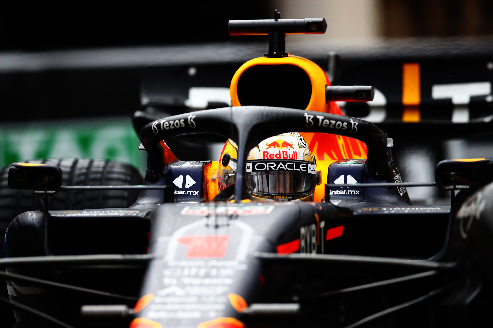

# redbull-pit-strategy

 

## Introduction

Are you interested in learning machine learning (ML)?  How about doing this in the context of the exciting world of F1 racing?!  Get your ML skills bootstrapped here with Oracle and Red Bull Racing!

This tutorial teaches ML analytics with a series of hands-on labs (HOLs) using the [Data Science](https://docs.oracle.com/en-us/iaas/data-science/using/data-science.htm) service in [Oracle Cloud Infrastructure](https://cloud.oracle.com/).

You'll learn how to get data from some public data sources, then how to analyze this data using some of the latest ML techniques. In the process, you'll perform Data Analysis, build ML models and make predictions about the time when it's most optimal to pit.

## Getting Started

There is some infrastructure that must be deployed before you can enjoy this tutorial.  See the [Terraform documentation](./terraform/README.md) for more information.

After you've completed the OCI registration process, proceed with the [pit strategy workshop.](./hols/pitstrategy/intro/intro.md)

### Prerequisites

You must have an **OCI** account. [Click here](https://www.oracle.com/cloud/free/?source=:ow:o:s:nav::DevoGetStarted&intcmp=:ow:o:s:nav::DevoGetStarted) to create a new cloud account.

This solution is designed to work mainly within OCI Data Science, allowing you to quickly be up-and-running:
* [Data Science](https://docs.oracle.com/en-us/iaas/data-science/using/data-science.htm)

## Notes/Issues

None at this time.

## URLs

* [Oracle and Red Bull partnership announcement](https://www.oracle.com/news/announcement/oracle-cloud-red-bull-racing-honda-032521.html)

## Contributing

This project is open source. Please submit your contributions by forking this repository and submitting a pull request!  Oracle appreciates any contributions that are made by the open source community.

## License

Copyright (c) 2021 Oracle and/or its affiliates.

Licensed under the Universal Permissive License (UPL), Version 1.0.

See [LICENSE](LICENSE) for more details.

 

## License

Copyright (c) 2022 Oracle and/or its affiliates.

Licensed under the Universal Permissive License (UPL), Version 1.0.

See LICENSE for more details.

ORACLE AND ITS AFFILIATES DO NOT PROVIDE ANY WARRANTY WHATSOEVER, EXPRESS OR IMPLIED, FOR ANY SOFTWARE, MATERIAL OR CONTENT OF ANY KIND CONTAINED OR PRODUCED WITHIN THIS REPOSITORY, AND IN PARTICULAR SPECIFICALLY DISCLAIM ANY AND ALL IMPLIED WARRANTIES OF TITLE, NON-INFRINGEMENT, MERCHANTABILITY, AND FITNESS FOR A PARTICULAR PURPOSE. FURTHERMORE, ORACLE AND ITS AFFILIATES DO NOT REPRESENT THAT ANY CUSTOMARY SECURITY REVIEW HAS BEEN PERFORMED WITH RESPECT TO ANY SOFTWARE, MATERIAL OR CONTENT CONTAINED OR PRODUCED WITHIN THIS REPOSITORY. IN ADDITION, AND WITHOUT LIMITING THE FOREGOING, THIRD PARTIES MAY HAVE POSTED SOFTWARE, MATERIAL OR CONTENT TO THIS REPOSITORY WITHOUT ANY REVIEW. USE AT YOUR OWN RISK.
