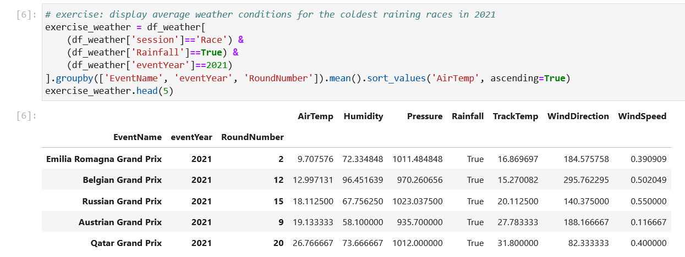
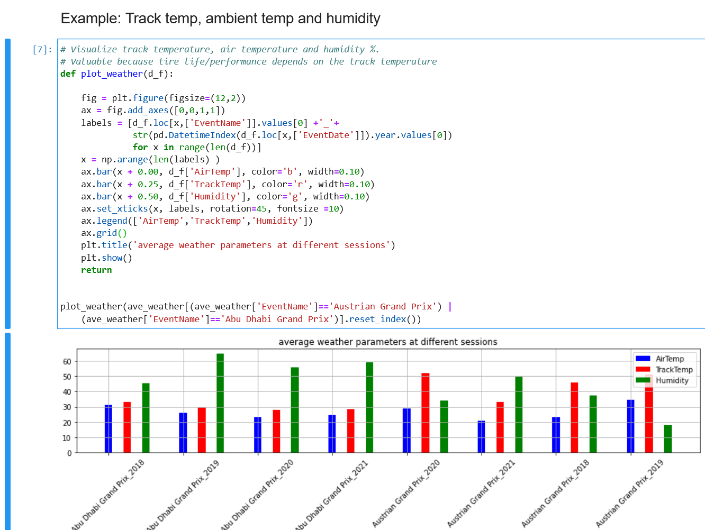
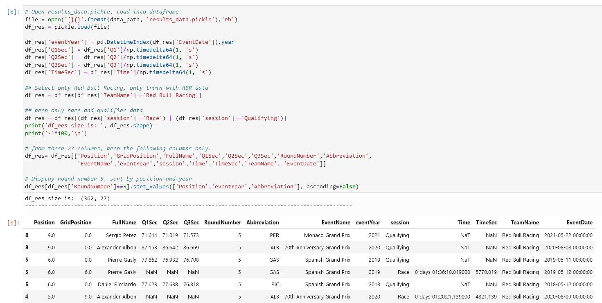
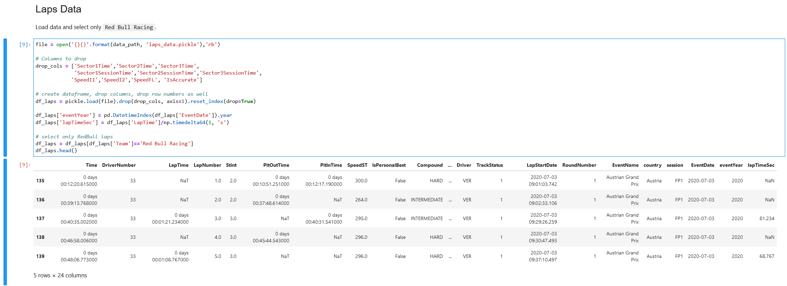

# Data Exploration

## Introduction

In this section of the workshop, we will focus on how to explore the data we have access to, in order to get a better understanding of the data and how we can leverage the power of ML against this data afterwards. Moreover, exploring the data will help us decide what to do with the data: we have several files and we can join these separate files into a bigger one to simplify our dataset.

For that, we'll look at the different data sources we have:

* Weather Data
* Race Results Data
* Lap Data

Estimated Time: 20 minutes

### Objectives

In this lab, you will learn about the specifics on Exploratory Data Analysis (EDA), why it's necessary to have a visual overview of your data, and how you can do that.

### Prerequisites

* An Oracle Free Tier, Paid or LiveLabs Cloud Account
* Active Oracle Cloud Account with available credits to use for Data Science service.
* [Previously created](https://github.com/oracle-devrel/redbull-pit-strategy/blob/dev/hols/pitstrategy/infra/infra.md) OCI Data Science Environment

## Task 1: Weather Data Exploration

1. We have one data point per minute, in each session for each Grand Prix. This means that we're operating with a very high level of granularity, which is good for us, because data is very rich.

    Weather data provides the following data channels per sample:

    * Time (datetime.timedelta): session timestamp (time only)
    * AirTemp (float): Air temperature in ºC
    * Humidity (float): Relative humidity in %
    * Pressure (float): Air pressure in mbars
    * Rainfall (bool): Shows if there is rainfall
    * TrackTemp (float): Track temperature in ºC
    * WindDirection (int): Wind direction in degrees (0°-359°). 0º equals the North
    * WindSpeed (float): Wind speed in km/h

    > **Note**: Before you proceed, make sure you select the correct environment on the right. Select the `conda` environment and click **Select**.

    

2. We read the dataset:

    We load our previously-concatenated data (in the last chapter) and add an additional column called eventYear:

    

3. Then, we plot the average weather for every race in our dataset for the last year, and make use of our new column `eventYear` to filter only year 2021:

    

4. Then, we aim to see what happens in extreme cases. For that, we'll print the coldest raining races for the last year. For that, we need to average weather conditions again, filter when Rainfall is true, for year 2021, and when the session is a race:

    

    As we can observe, track temperature is always a bit hotter than the air temperature (in Celsius). It's useful to know that there are some races where temperature drops below 10ºC.

5. Finally, we plot average air temperature, track temperature and humidity percentages for two races: Abu Dhabi and the Austrian GP.

    

    This is useful in case we need to take a visual look at specific data within our dataset: these visualizations can be adjusted to fit any type of race, Grand Prix, session, and weather conditions.

## Task 2: Results Data Exploration

1. Once we've taken a look at weather data, let's look into results data. For each driver, we have their starting position (grid position), their final position, their final qualifying times (Q1, Q2, Q3) and additional event information.

    > Note: All dataframe columns will always exist even if they are not relevant for the current session. For example, if a driver doesn't qualify to Q3, they will still have a Q3 column with a NaN value inside.

    The following information is provided for each driver as a column of the dataframe:

    * DriverNumber (str): The number associated with this driver in this session (usually the drivers permanent number)
    * BroadcastName (str): First letter of the drivers first name plus the drivers full last name in all capital letters. (e.g. ‘P GASLY’)
    * FullName (str): The drivers full name (e.g. “Pierre Gasly”)
    * Abbreviation (str): The drivers three letter abbreviation (e.g. “GAS”)
    * TeamName (str): The team name (short version without title sponsors)
    * TeamColor (str): The color commonly associated with this team (hex value)
    * FirstName (str): The drivers first name
    * LastName (str): The drivers last name
    * Position (float): The drivers finishing position (values only given if session is ‘Race’, ‘Qualifying’ or ‘Sprint Qualifying’)
    * GridPosition (float): The drivers starting position (values only given if session is ‘Race’ or ‘Sprint Qualifying’)
    * Q1 (pd.Timedelta): The drivers best Q1 time (values only given if session is ‘Qualifying’, other values will be NaN)
    * Q2 (pd.Timedelta): The drivers best Q2 time (values only given if session is ‘Qualifying’, other values will be NaN)
    * Q3 (pd.Timedelta): The drivers best Q3 time (values only given if session is ‘Qualifying’, other values will be NaN)
    * Time (pd.Timedelta): The drivers total race time (values only given if session is ‘Race’ or ‘Sprint Qualifying’ and the driver was not more than one lap behind the leader)
    * Status (str): A status message to indicate if and how the driver finished the race or to indicate the cause of a DNF. Possible values include but are not limited to ‘Finished’, ‘+ 1 Lap’, ‘Crash’, ‘Gearbox’, … (values only given if session is ‘Race’ or ‘Sprint Qualifying’)
    * Status (float): The number of points received by each driver for their finishing result.

    > Note: By default, the session results are indexed by driver number and sorted by finishing position.

    This dataset is also very complete, however we'll filter out our data based on some **assumptions**:

    * Teams don't all have the same strategy due to different car designs. Therefore, we should only consider data coming from Oracle RedBull.
    * Practice sessions are often used by teams to get used to car setups and the circuit where they'll be competing. Therefore, we shouldn't consider these sessions, as they are not as competitive as qualifying and the race.

    

## Task 3: Lap Data Exploration

1. For lap data, we should also only consider Oracle RedBull data, as this model should work within the timeframes of RedBull's cars.

    Our laps dataset contains the following variables:

    * Time (pandas.Timedelta): Session time when the lap time was set (end of lap)
    * Driver (string): Three letter driver identifier
    * DriverNumber (str): Driver number
    * LapTime (pandas.Timedelta): Recorded lap time. Officially deleted lap times will not be deleted here. Deleting laps is currently not supported.
    * LapNumber (int): Recorded lap number
    * Stint (int): Stint number
    * PitOutTime (pandas.Timedelta): Session time when car exited the pit
    * PitInTime (pandas.Timedelta): Session time when car entered the pit
    * Sector1Time (pandas.Timedelta): Sector 1 recorded time
    * Sector2Time (pandas.Timedelta): Sector 2 recorded time
    * Sector3Time (pandas.Timedelta): Sector 3 recorded time
    * Sector1SessionTime (pandas.Timedelta): Session time when the Sector 1 time was set
    * Sector2SessionTime (pandas.Timedelta): Session time when the Sector 2 time was set
    * Sector3SessionTime (pandas.Timedelta): Session time when the Sector 3 time was set
    * SpeedI1 (float): Speedtrap sector 1 in km/h
    * SpeedI2 (float): Speedtrap sector 2 in km/h
    * SpeedFL (float): Speedtrap at finish line in km/h
    * SpeedST (float): Speedtrap on longest straight in km/h
    * IsPersonalBest (bool): Flag that indicates whether this lap is the official personal best lap of a driver. If any lap of a driver is quicker than their respective personal best lap, this means that the quicker lap is invalid and not counted. This can happen it the track limits were execeeded, for example.
    * Compound (str): Tyres event specific compound name: SOFT, MEDIUM, HARD, INTERMEDIATE, WET (the actual underlying compounds C1 to C5 are not differentiated).
    * TyreLife (float): Laps driven on this tire (includes laps in other sessions for used sets of tires)
    * FreshTyre (bool): Tyre had TyreLife=0 at stint start, i.e. was a new tire
    * Team (str): Team name
    * LapStartTime (pandas.Timedelta): Session time at the start of the lap
    * LapStartDate (pandas.Timestamp): Timestamp at the start of the lap
    * TrackStatus (str): A string that contains track status numbers for all track status that occurred during this lap. The meaning of the track status numbers is explained in fastf1.api.track_status_data(). For filtering laps by track status, you may want to use Laps.pick_track_status().
    * IsAccurate (bool): Indicates that the lap start and end time are synced correctly with other laps. Do not confuse this with the accuracy of the lap time or sector times. They are always considered to be accurate if they exist! If this value is True, the lap has passed as basic accuracy check for timing data. This does not guarantee accuracy but laps marked as inaccurate need to be handled with caution. They might contain errors which can not be spotted easily. Laps need to satisfy the following criteria to be marked as accurate:
        * Not an inlap or outlap
        * Set under green or yellow flag (the api sometimes has issues with data from SC/VSC laps)
        * Isn't the first lap after a safety car period (issues with SC/VSC might still appear on the first lap after it has ended)
        * Has a value for lap time and all sector times
        * The sum of the sector times matches the lap time (If this were to ever occur, it would also be logged separately as a data integrity error. You usually don’t need to worry about this.)

2. However, we only want a subset of these variables. Additionally, we'll only **select RedBull** laps as discussed.

    

3. In order to check the consistency of our data between data objects (Lap data and Results data), we'll check if the best qualifying time for a driver is the same in both cases. It allows us to check inconsistencies in between files and fix them if needed. We'll test with Sergio Perez's data for the Abu Dhabi Grand Prix, in 2021.

    

    As we can observe, Sergio's data is consistent within datasets.
    > Note: this is only an example. There are some instances where there are some inconsistencies between datasets. In the following chapters, we'll cover how we've dealt with these inconsistencies.

## Conclusions

Now that we have a bit more practice on how to visualize data (both in _tabular_ and _graphical_ ways), let's proceed to the next chapter, where we'll **merge** all these different dataset's types into a bigger file, which will be the input to our Machine Learning models. 

You may now [proceed to the next lab](#next).

## Acknowledgements

* **Author** - Nacho Martinez, Data Science Advocate @ DevRel
* **Contributors** - Victor Martin - Product Strategy Director, Alireza Dibazar - Principal Data Scientist, Vesselin Diev - Senior Director of Data Science, ML Innovation Team
* **Last Updated By/Date** - July 26th, 2023
