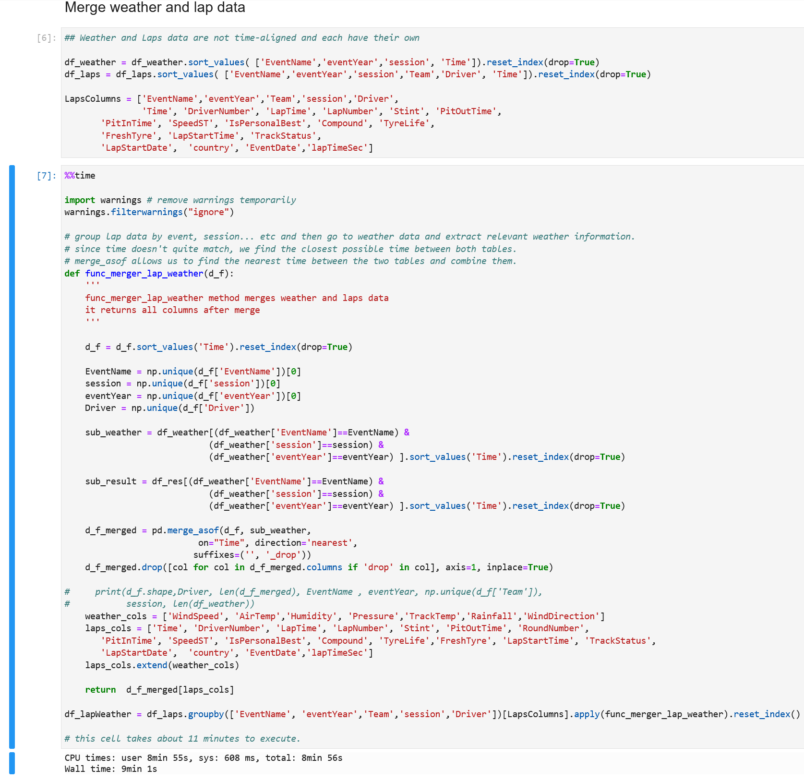
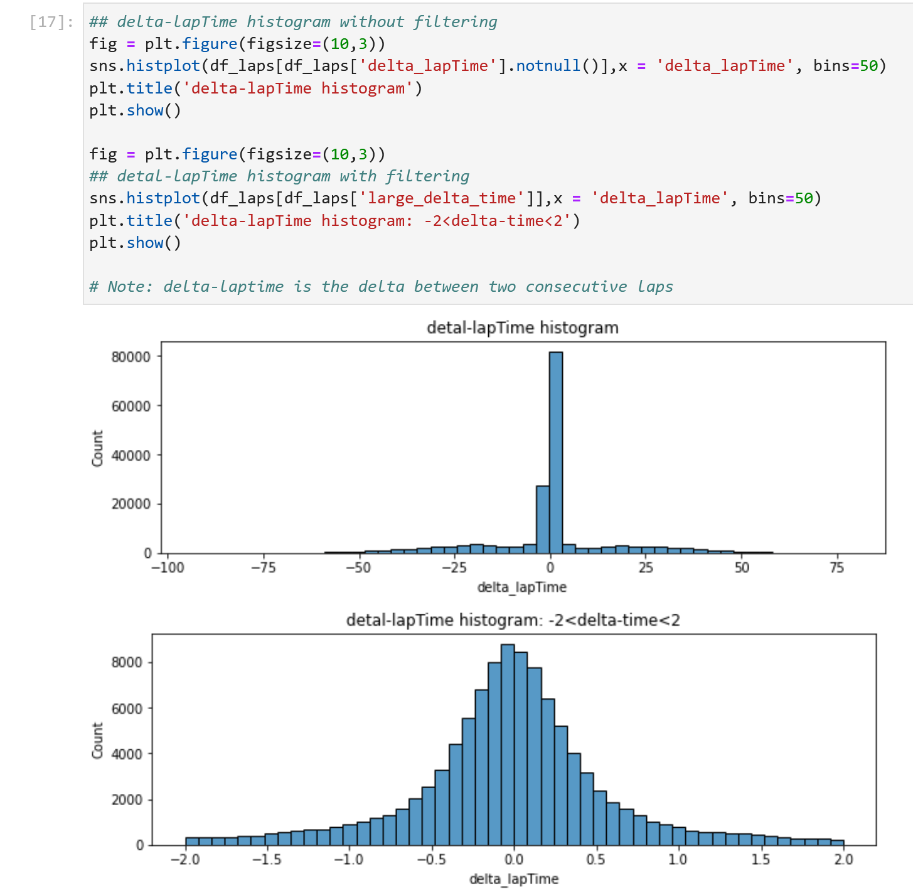
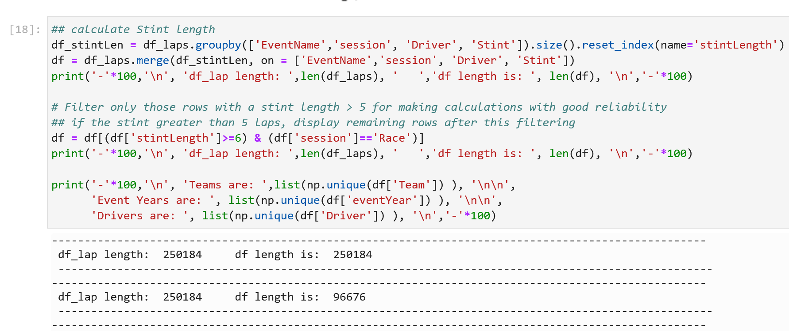
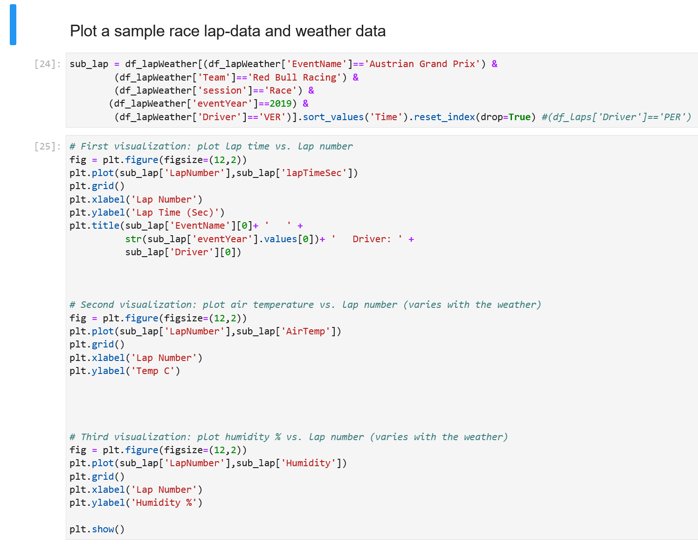
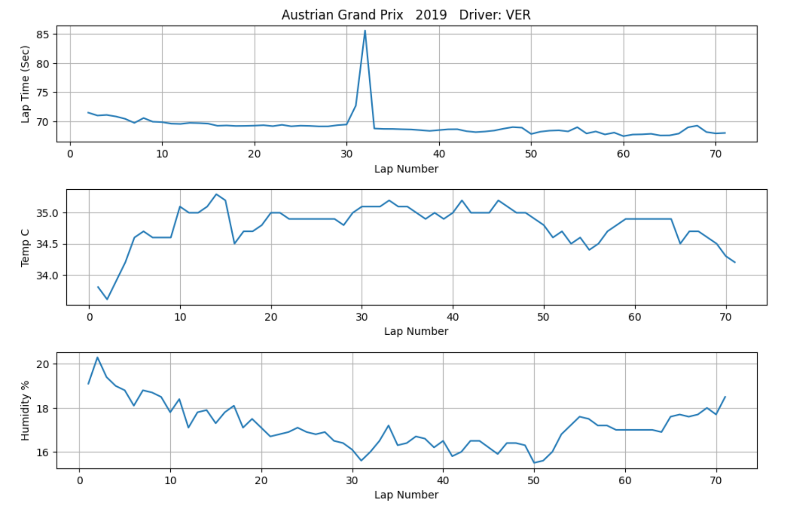
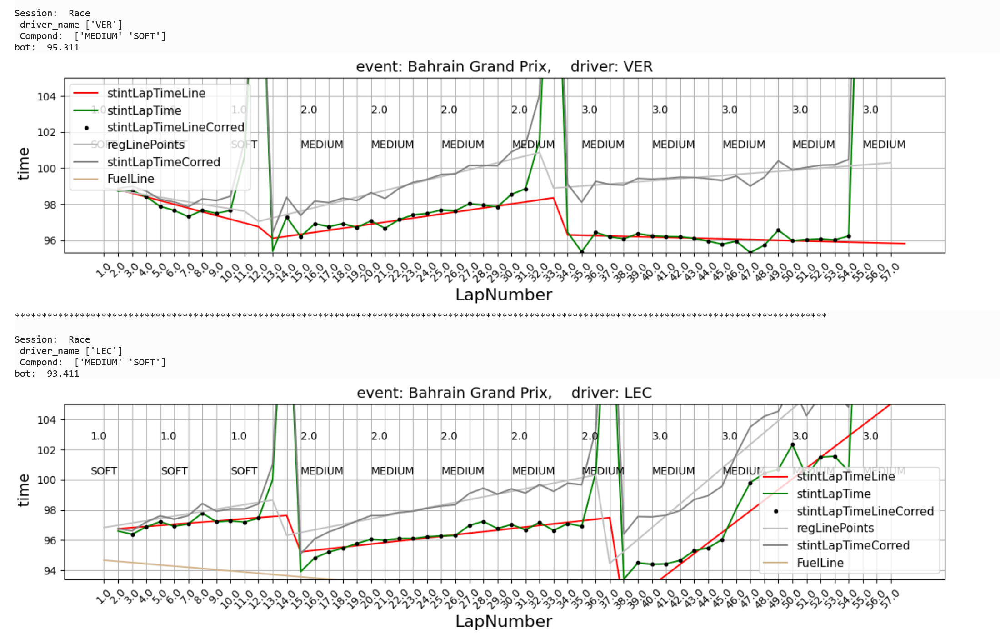
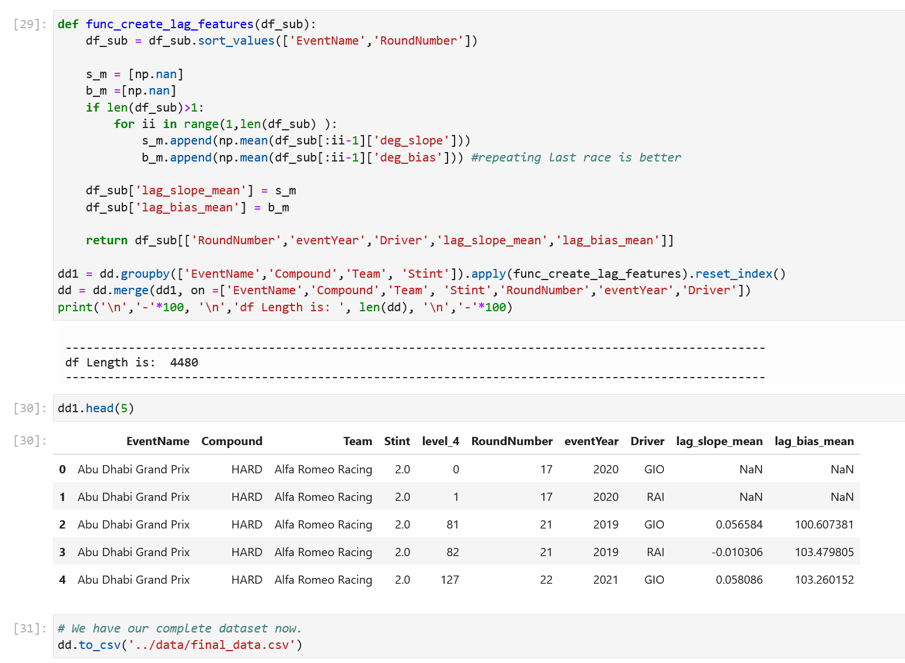

# Lab 4: Data Merging

## Introduction

After we have extracted and analyzed our datasets, it's time to merge them into a more complete file/dataset that combines the characteristics of the smaller files we already have. Then, we will use this merged dataset as an input to our Machine Learning models.

Estimated Lab Time: 20 minutes

### Prerequisites

* An Oracle Free Tier, Paid or LiveLabs Cloud Account
* Active Oracle Cloud Account with available credits to use for Data Science service.
* [Previously created](https://github.com/oracle-devrel/redbull-pit-strategy/blob/dev/hols/pitstrategy/infra/infra.md) OCI Data Science Environment

## Task 1: Merging Weather and Lap Data -> df_lapWeather

We group lap data by (event, team, session, driver), then we go to weather data and extract relevant weather information.

Once we have both things, and since **timestamps** from both tables have information that don't **quite** match, we use the function _`pd.merge_asof()`_ to find the **closest** possible time between two tables, and merge them based on the nearest timestamps; and we combine both tables.

> Note that this task takes about 11 minutes to run with 8 OCPU (16 vcpus).

## Task 2: Expanding `df_lapWeather` with Position and GridPosition -> `df_agg`

At this point of the lab, we have lap data available, and also weather data combined with it.

We want to add grid position and summarize lap data. Summarization means that we need to extract features up until the race. And anything that happens before a race should be considered incoming, valid data for the upcoming race.

To do that, we take the best qualifying time, grid position, position, and then an **averaged weather condition**. Why? Because we have a different level of detail/granularity in our **weather** dataset (it's a time series where we have data every minute) than this new data we want to add.

Therefore, we must **summarize** it in some way, and obtain a numerical value that represents a whole race
> For example, instead of having fifteen different temperatures for one stint; we should have the average weather conditions during the stint.

As a conclusion, we should have the **same level of granularity** from both datasets, in order to merge them properly.

> Note that this task takes about 10-15 minutes to run with 8 OCPU (16 vcpus).

## Task 3: Add Track Information to df_agg

We add and complement our _`df_agg`_ dataset with these two additional columns. For that, we use the CSV file called _`circuit_length.csv`_ inside the `data` directory.

> Note: circuit length contains information about each circuit: circuit name / title, circuit length in kilometers, and the number of designated laps for each circuit.

Finally, we create a CSV file with almost all things we need to be done with the data merging process.

## Task 4: Tyre Degradation and Fuel Adjustment Lines

For our dataset, we will also calculate the **slope** and **bias** for tyre degradation and fuel adjustment in a linear regression model.

Considering that _`y = mx + b`_, we will consider m as the slope and b as the bias to calculate.

Just for visualization purposes, the following _`-2<delta-lapTime<2`_ figure looks at what happens when two consecutive laps occur, and what is the time delta (the absolute value of the difference of both lap times) in seconds, where the maximum lap time delta is within -2 and 2 seconds of the next one:

Now, we will filter out rows that don't have **enough** valuable data: these will be stints (period between one pit stop and the next one) where the number of laps run is less than **5**. We will consider 5 as our threshold value to determine if this is data we can consider into our final dataset or not.

Finally, from this reduced dataset, with only more than 5 laps per stint, we'll calculate their linear regression parameters **m** and **b** as mentioned. For that, we create two auxiliary functions for calculating fuel and tyre degradation lines and biases.

Then we proceed to perform the same calculations for tyre degradation, and add their linear regression parameters to our dataset.

## Task 5: Final Visualizations

With our final dataset, we can see that it looks like a very complete dataset with several potentially attractive variables for Machine Learning. We won't know for sure until the next chapter, but before we proceed, we plot a few sample laps from Verstappen from the Austrian Grand Prix in 2019.

And finally we can comparedifferent stint lap times, and see their fuel lines and their **corrected lap times** (lap time minus the time lost per round due to fuel weight and tyre degradation).

> **Note**: In the above figure, we can see that in the same race, both drivers pitted at similar times, although Verstappen pitted a bit earlier (about 4 laps earlier on average). Also, we observe that Leclerc's last stint has a very high slope, which indicates that the lap times weren't great compared to Verstappen's, even though both drivers used the same tyre strategy (soft, then medium, then medium tyres) in Bahrain in 2019. This visualization encompasses what actually happened during the race: Leclerc did the fastest race time in the 38th lap, then dropped back with higher lap times in the last stint compared to Verstappen, who sustained very consistent lap times until the end of the race. Verstappen gained 1 position and Leclerc lost 2 positions compared to their starting grid positions, as he started having problems with the engine in lap 48.

Also note that, depending on the number of laps per stint, the slope of the stint lap times may vary in reliability: a stint with 20 laps will be much more reliable to look at than a stint with just 6 laps (remember that we already filtered out all stints with less than 5 laps).

## Task 6: Lag Features

This is the last thing we need to fix. As we mentioned before, anything up to a race should be considered as an input to the race.

The main focus of this project is to create an ML model to predict the best tyre strategy, meaning **the optimal length for the first stint for our drivers**.

**However**, we can't use the previously-calculated linear regression parameters from a race, to predict the same race itself; as the race hasn't begun yet. Additionally, there's a lot of noise since the number of laps per stint doesn't quite have as many data points as we want.

Therefore, we will create an **average slope and bias** based on the **average tyre compound for last year's  event** (for the same driver, as drivers have different degradation patterns), and have this as a metric to measure these linear regression parameters in a **normalized** way. We'll call them **lag features**. 

> Note: we will only perform this if the event has happened more than once, and we have a baseline to compare the current race with another year's circuit and characteristics.

Due to this, we'll create a function called _`func_create_lag_features`_, where we average the values from the last event into this races' degradation slopes and biases:

Then, we save this dataset as the final dataset (_`final_data.csv`_).

## Conclusions

In this chapter, we have:

* Visualized data
* Added starting and ending position for each dataset
* Harmonized datasets' level of detail
* Merged data from an additional track dataset
* Performed data augmentation with linear regression parameters (slope and bias) for Tyre and Fuel degradation
* Adjusted lag features to prevent our model from incorrectly making real-time predictions

Let's proceed to the next chapter, where we'll create a Machine Learning model from our dataset, see which variables are indeed useful and which aren't, and get ready to deploy this Machine Learning model to the Internet.

You may now [proceed to the next lab](#next).

## Acknowledgements

* **Author** - Nacho Martinez, Data Science Advocate @ DevRel
* **Contributors** - Victor Martin - Product Strategy Director, Alireza Dibazar - Principal Data Scientist, Vesselin Diev - Senior Director of Data Science, ML Innovation Team
* **Last Updated By/Date** - July 17th, 2023
