# Infrastructure

## Introduction

[Lab 1](videohub:1_oan7duyo)

In this lab, we will build the infrastructure that we will use to run the rest of the workshop.

The main element that we will be creating is a **Data Science** session and notebook, to experiment with the newly-generated data using notebooks.

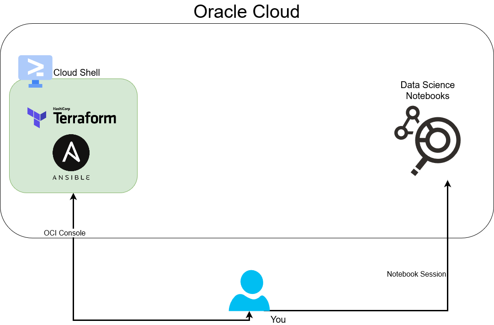

We will use Cloud Shell to execute _`start.sh`_ script that will call Terraform to deploy all the infrastructure required and setup the configuration. If you don't know about Terraform, don't worry, there's no need.

Also, there are no installation requirements: we will use Cloud Shell (which has Terraform installed by default) to deploy our infrastructure.

> **Note**: Terraform is an Open Source tool to deploy resources in the cloud with code. You declare what you want in Oracle Cloud and Terraform make sure you get the resources created. Want to learn more? Feel free to check [Terraform's code in this repository](https://github.com/oracle-devrel/leagueoflegends-optimizer/tree/main/dev/terraform) after the workshop.

Estimated Time: 15 minutes

### Objectives

In this lab, you will learn how to:

- Use Oracle Cloud Infrastructure for your Compute needs
- Deploy resources using Terraform and Ansible
- Optionally download the datasets we will use, if you're not interested in doing the Data Extraction lab

### Prerequisites

- An Oracle Free Tier, Paid or LiveLabs Cloud Account with available credits to use for Data Science service.
- In your Oracle Cloud account, you should have administrator permissions, otherwise you may get some errors during the automatic deployment.

## Task 1: Cloud Shell

1. From the Oracle Cloud Console, click on **Cloud Shell**.
    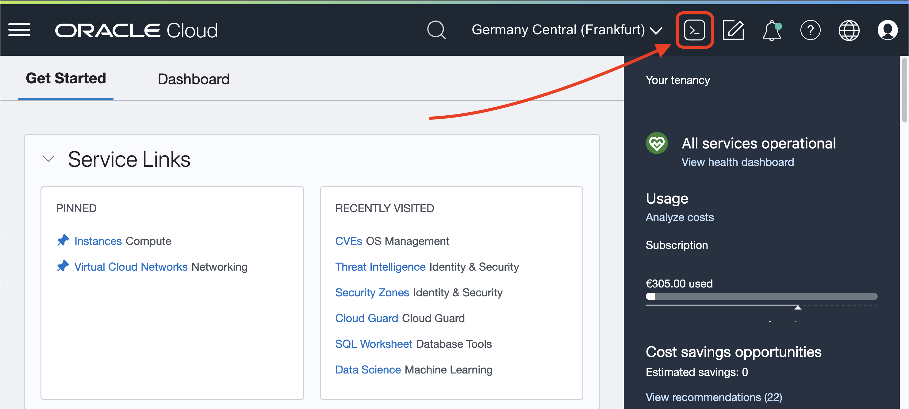

2. As soon as the Cloud Shell is loaded, you can download the assets to run this lab.

    ```bash
    <copy>git clone https://github.com/oracle-devrel/redbull-pit-strategy.git</copy>
    ```

3. The result will look like this:
    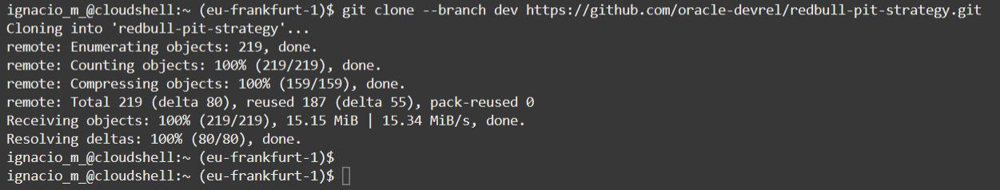

4. Change directory with _`cd`_ to the _`redbull-pit-strategy`_ directory:

    ```bash
    <copy>cd redbull-pit-strategy</copy>
    ```

## Task 2: Deploy with Terraform

1. By running the following command, we're going to create a file called _`.env.json`_ that contains the necessary variables for Terraform to perform the automatic deployment, including the number of desired CPUs for our Data Science environment. Run on Cloud Shell the following command:

    ```bash
    <copy>npx zx scripts/setenv.mjs</copy>
    ```

2. It will run a dependency check and right after that, prompt you for the desired compartment name where we'll deploy our Data Science environment. If you are in a trial, or brand new to Oracle Cloud, just leave it empty and type _`ENTER`_ (this will use the _`root`_ compartment).
    > **Note**: If you want to deploy on a specific compartment, type the name of the compartment (not its ID).

3. The script will now ask for the `Data Science CPU number`. One CPU is enough, but feel free to allocate up to 4 CPUs (if you are in a Free Trial). You should see something like this:
    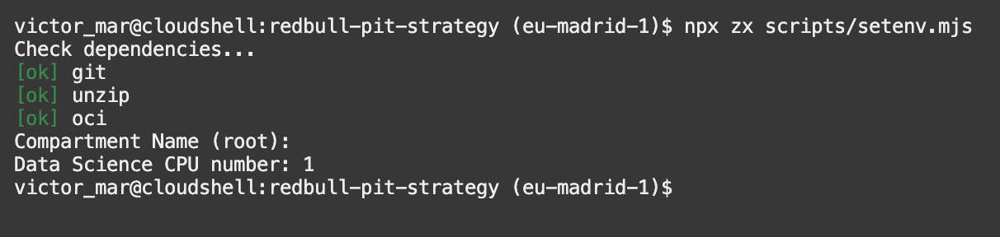

4. Terraform uses a file called _`terraform.tfvars`_ that contains the variables Terraform uses to talk to Oracle Cloud and set up the deployment you indicated in step 1  the way you want it. You are going to use the script _`tfvars.mjs`_, which will ask you for information to create the `terraform.tfvars` file for you. Run the following command on your Cloud Shell terminal:

    ```bash
    <copy>npx zx scripts/tfvars.mjs</copy>
    ```

5. The script will create the `terraform.tfvars` file:
    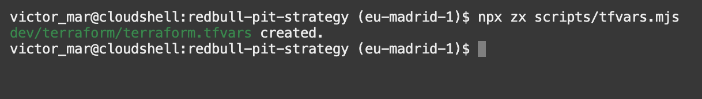

## Task 3: Start Deployment

Now that we've set up all necessary scripts and variables, it's time to run the Terraform start script.

1. Change directory to `dev`:

    ```bash
    <copy>cd dev</copy>
    ```

2. Run the `start.sh` script:

    ```bash
    <copy>./start.sh</copy>
    ```

3. The script will run and it looks like this:
    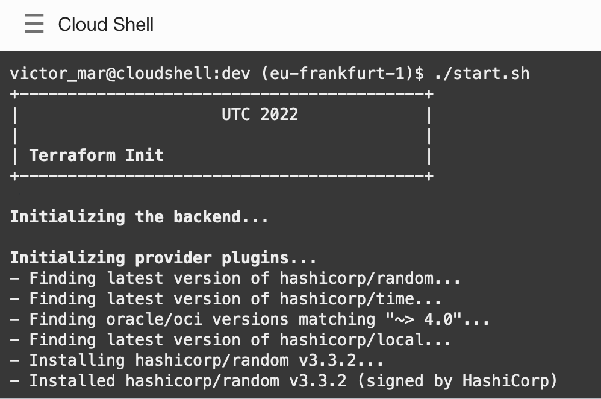

4. Terraform will create resources for you:
    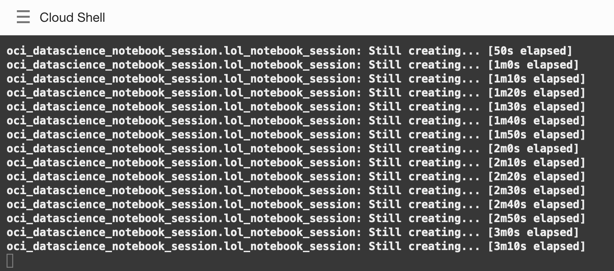

5. After the script is done running, it will print the output of all the work done, including a URL to our Data Science environment:
    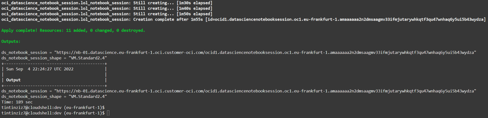

6. Copy the Data Science notebook URL from the output variable _`ds_notebook_session`_. This is the URL we will use to connect to our Data Science environment.
    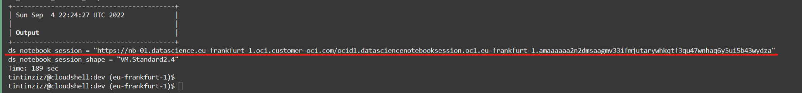

    > Note: login credentials for the Data Science notebook are the same as the ones used to access Oracle Cloud Infrastructure.

## Task 4: Accessing Notebook

Having just created our OCI Data Science environment, we need to install the necessary Python dependencies to execute our code. For that, we'll access our environment.

- The easiest way is to access into the notebook **through the URL** that we previously copied from Terraform's output.

    

    If you have done it this way, make sure to **skip through to the next task**.

- (Optionally) We can also access to the notebook via the OCI console, on the top left hamburger menu:

    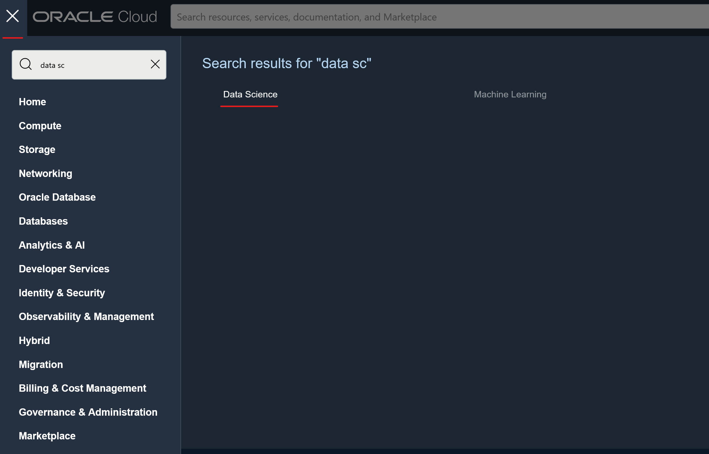

    > You may find the Data Science section by also searching in the top left bar, or in the Analytics & AI tab, if it doesn't appear in "Recently visited" for you:

    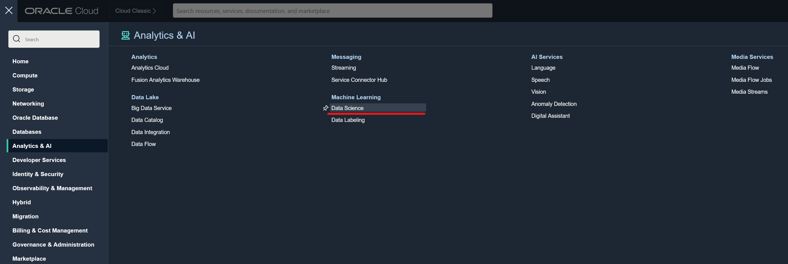

    Now, we have access to a [list of our Data Science projects launched within OCI.](https://cloud.oracle.com/data-science/projects) We access our project, and inside our project we'll find the notebook.

    > The name of the notebook may be different than shown here in the screenshot.

    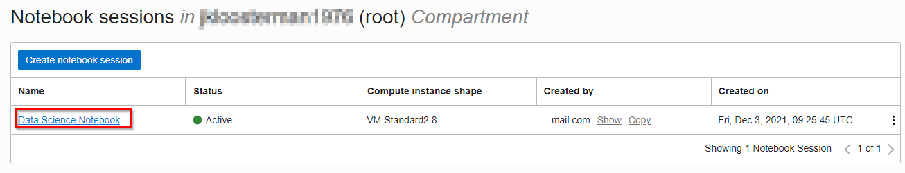

    

    You should now see the Jupyter environment

    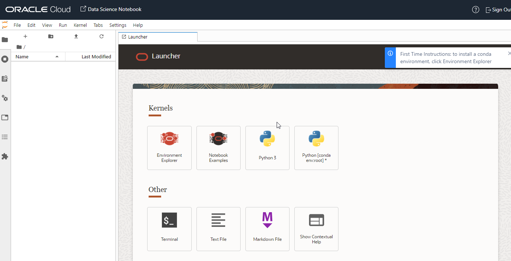

## Task 5: Setting up Data Science Environment

We now need to load our notebook into our environment.

1. Opening a **Terminal** inside the _'Other'_ section the console and re-downloading the repository again:

    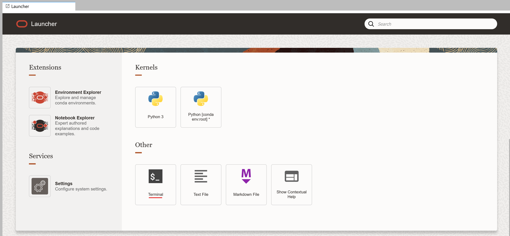

2. Then, we re-clone the repository:

    ```bash
    <copy>git clone https://github.com/oracle-devrel/redbull-pit-strategy</copy>
    ```

3. Install the conda environment

    ```bash
    <copy>odsc conda create -n myconda</copy>
    ```

    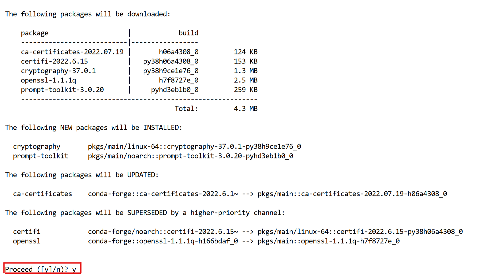

4. Activate the newly-created conda environment:

    ```bash
    <copy>
    conda activate /home/datascience/conda/myconda_v1_0
    </copy>
    ```

5. Install Python 3.8 within the conda environment:

    ```bash
    <copy>
    conda install -y python=3.8
    </copy>
    ```

6. Install Python dependencies:

    ```bash
    <copy>
    pip install -r redbull-pit-strategy/requirements.txt
    </copy>
    ```

> Note: make sure to accept prompts by typing 'y' as in 'Yes' when asked.

After these commands, all requirements will be fulfilled and we're ready to execute our notebooks with our newly created conda environment.

## Task 6: Accessing our Notebooks

1. Once we've re-downloaded the repository (or used the upload button to transfer the notebooks), we should see the repository / files in our file explorer:

    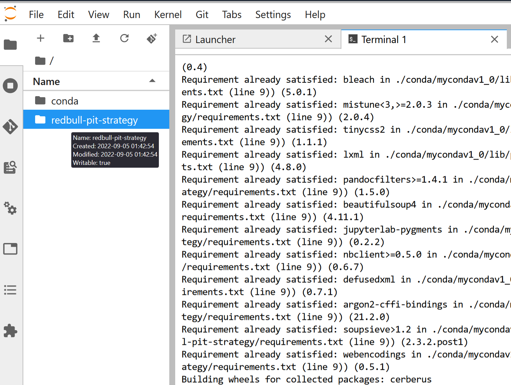

2. We navigate to the _`redbull-pit-strategy/notebooks/`_ directory and open each one of the notebooks. This is the list of notebooks we will review:

- [_`00 pull data.ipynb`_](https://github.com/oracle-devrel/redbull-pit-strategy/blob/dev/notebooks/00%20pull%20data.ipynb)
- [_`01 data exploration.ipynb`_](https://github.com/oracle-devrel/redbull-pit-strategy/blob/dev/notebooks/01%20data%20exploration.ipynb)
- [_`02 merge data.ipynb`_](https://github.com/oracle-devrel/redbull-pit-strategy/blob/dev/notebooks/02%20merge%20data.ipynb)
- [_`03 Model Training.ipynb`_](https://github.com/oracle-devrel/redbull-pit-strategy/blob/dev/notebooks/03%20Model%20Training.ipynb)
- [_`04 deploy model.ipynb`_](https://github.com/oracle-devrel/redbull-pit-strategy/blob/dev/notebooks/04%20deploy%20model.ipynb)

## Task 7: Downloading DataSets

As we mentioned, the Data Extraction part is optional and will take a very long time to complete (about 5-6 hours in total) to pull all data from all sources (this is what we do in Lab 3).

Therefore, as we don't have as much time, and if you're interested in getting started as quickly as possible, I recommend you download the official datasets by following this guide.

1. We now need to load our datasets into our environment. For that, we reuse the terminal we created in the previous step:

    

2. Then, we execute the following command, which will download all necessary datasets:

    ```bash
    <copy>
    wget https://objectstorage.eu-frankfurt-1.oraclecloud.com/p/pofZzTCEXSkfykKLL0FeZCf5bmugGsnn-2xbRt17vdoWhKv5aCWqy8-weaqRW46_/n/axywji1aljc2/b/league-hol-ocw-datasets/o/redbull_ocw_2023.zip && unzip redbull_ocw_2023.zip -d /home/datascience/.
    </copy>
    ```

3. After executing the command, you should see something like this:

    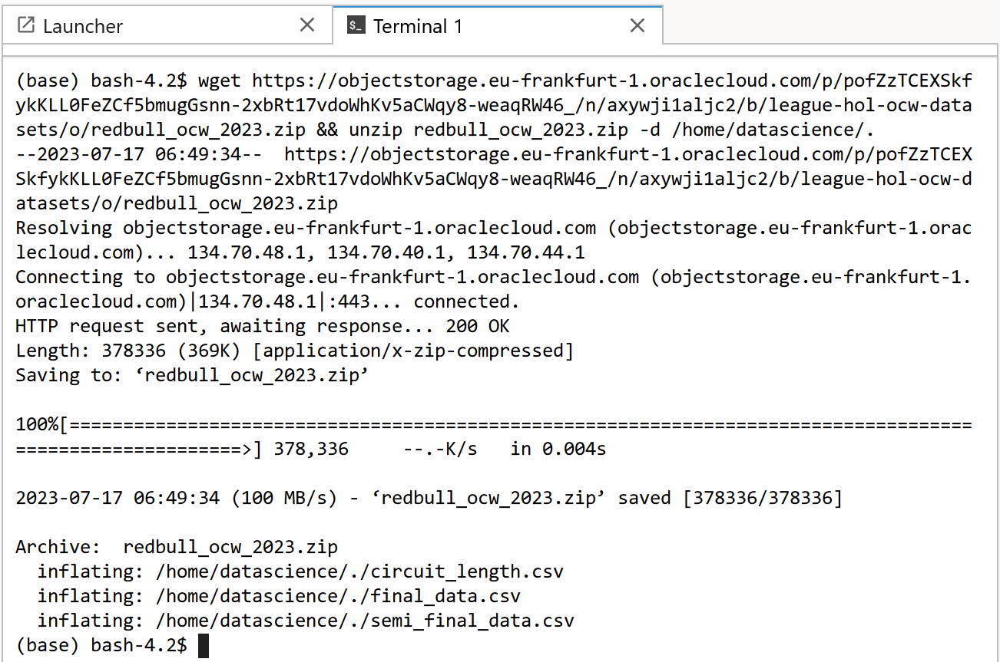

4. And you should see these three files in your root directory:

    - _`circuit_length.csv`_
    - _`final_data.csv`_
    - _`semi_final_data.csv`_

> **Note**: if you prefer, you can also download the datasets from Kaggle, a Data Science community for Datasets and Machine Learning models. [Here's a link to the official Kaggle repository](https://www.kaggle.com/datasets/jasperan/redbull-f1-pit-strategy) where the same data is available.

You may now [proceed to the next lab](#next).

## Acknowledgements

- **Author** - Nacho Martinez, Data Science Advocate @ DevRel
- **Contributors** - Victor Martin - Product Strategy Director, Alireza Dibazar - Principal Data Scientist, Vesselin Diev - Senior Director of Data Science, ML Innovation Team
- **Last Updated By/Date** - July 24th, 2023
