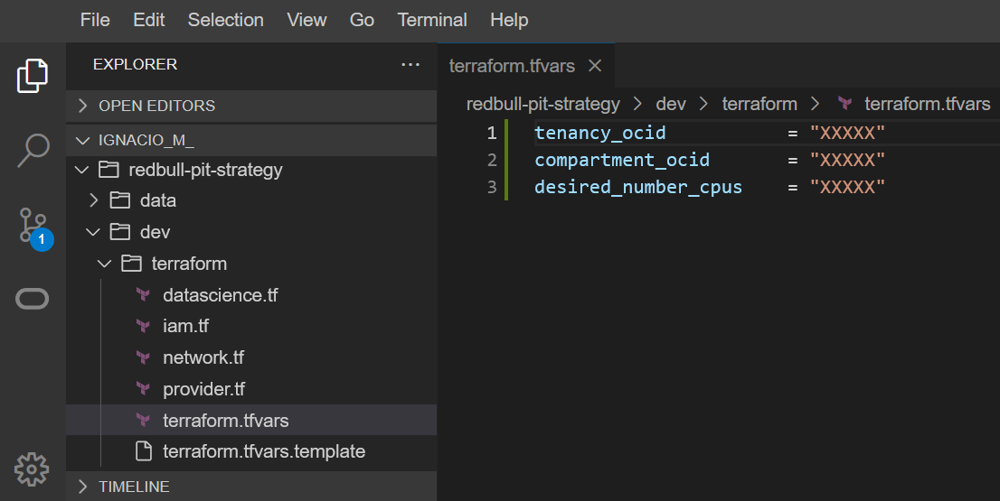

# Infrastructure

## Introduction

In this lab we will build the infrastructure that we will use to run the rest of the workshop.

The main four elements that we will be creating are:
- **Data Science** session and notebook, to experiment with the newly-generated data using notebooks.


We will use Cloud Shell to execute `start.sh` script that will call Terraform to deploy all the infrastructure required and setup the configuration. If you don't know about Terraform, don't worry, there is no need. Also, there are no installation requirements: we will use Cloud Shell (which has Terraform installed by default) to deploy our infrastructure. 

Terraform is an Open Source tool to deploy resources in the cloud with code. You declare what you want in Oracle Cloud and Terraform make sure you get the resources created.

Do you want to learn more? Feel free to check [Terraform's code in this repository](../../../dev/terraform/) after the workshop.

Estimated Lab Time: 15 minutes

### Prerequisites

* An Oracle Free Tier, Paid or LiveLabs Cloud Account
* Active Oracle Cloud Account with available credits to use for Data Science service.


## Task 1: Cloud Shell

1. From the Oracle Cloud Console, click on **Cloud Shell**.
  

2. As soon as the Cloud Shell is loaded, you can download the assets to run this lab.
    ```
    <copy>git clone --branch dev https://github.com/oracle-devrel/redbull-pit-strategy.git</copy>
    ```

3. The result will look like this:
  

4. Change directory with `cd` to `redbull-pit-strategy` directory:
    ```
    <copy>cd redbull-pit-strategy/dev/</copy>
    ```
5. Terraform use a file called `tfvars` that contains the variables Terraform uses to talk to Oracle Cloud and set up your deployment the way you want it. You are going to copy a template we provide to use your own values. Run on Cloud Shell the following command.

    ```
    <copy>cp terraform/terraform.tfvars.template terraform/terraform.tfvars</copy>
    ```

## Task 2: Deploy with Terraform

1. Click on **Code Editor**. Next to the Cloud Shell one.
    

2. On the **Code Editor**, inside the Explorer section on the left panel, expand your username and navigate onto _`dev/terraform`_. You should see the file **`terraform.tfvars`**. Click on it: 
    

3. The file will open and you can copy values you will get from running commands on Cloud Shell and paste it on the Code Editor.
4. Copy the output of the following command as the tenancy OCID:
    ```
    <copy>echo $OCI_TENANCY</copy>
    ```

    

5. Copy the output of the same command as the compartment OCID:
    ```
    <copy>echo $OCI_TENANCY</copy>
    ```
    
    > Note: we can paste the same OCID here in both tenancy and compartment because the root compartment in a tenancy is equal to the tenancy's OCID.

    

    > **Note only for experienced Oracle Cloud users:**<br>
    > Do you want to deploy the infrastructure on a specific compartment?<br>
    > You can get the Compartment OCID in different ways.<br>
    > The coolest one is with OCI CLI from the Cloud Shell.<br>
    > You have to change _`COMPARTMENT_NAME`_ for the actual compartment name you are looking for and run the command:
    > ```
    > <copy>oci iam compartment list --all --compartment-id-in-subtree true --query "data[].id" --name COMPARTMENT_NAME</copy>
    > ```

6. Save the file in the Code Editor.
    


## Task 3: Start Deployment

1. Run the `start.sh` script
    ```
    <copy>./start.sh</copy>
    ```

2. The script will run and it looks like this.
    

3. Terraform will create resources for you, and during the process it will look like this.
    

4. The final part of the script is to print the output of all the work done.
    

5. Copy the Data Science notebook URL from the output variable _`ds_notebook_session`_. This is the URL we will use to connect to our Data Science environment.
    

    > Note: login credentials for the Data Science notebook are the same as the ones used to access Oracle Cloud Infrastructure.


You may now [proceed to the next lab](#next).


## Acknowledgements

* **Author** - Nacho Martinez, Data Science Advocate @ DevRel
* **Contributors** - Alireza Dibazar, Victor Martin - Product Strategy Director
* **Last Updated By/Date** - September 5th, 2022
