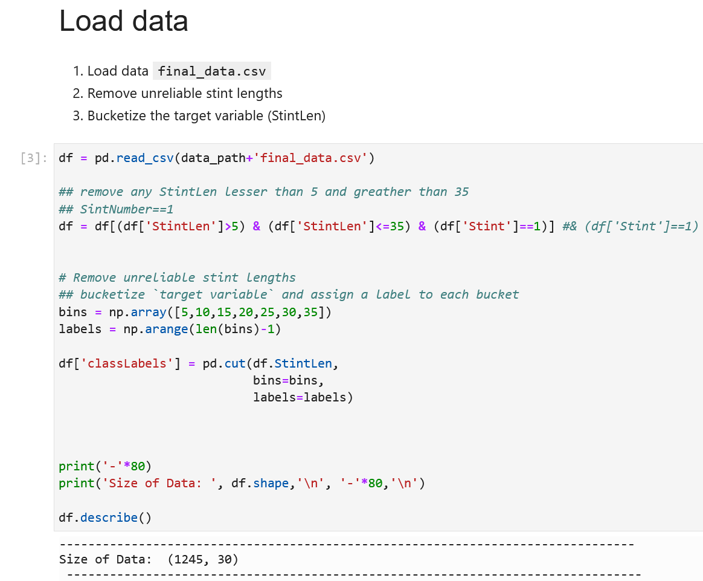
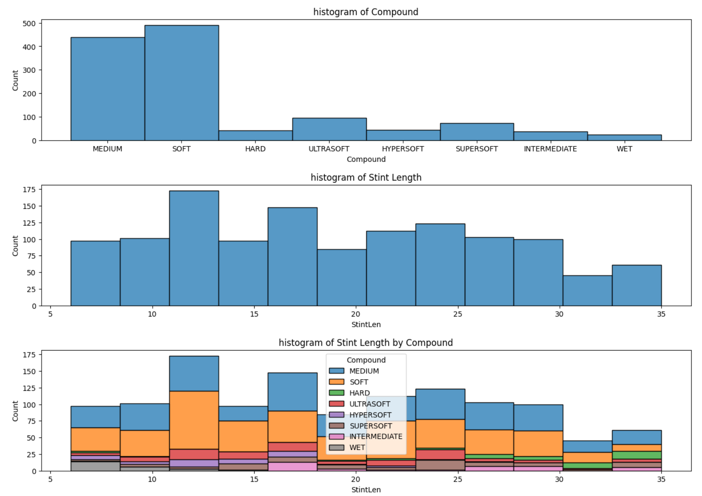
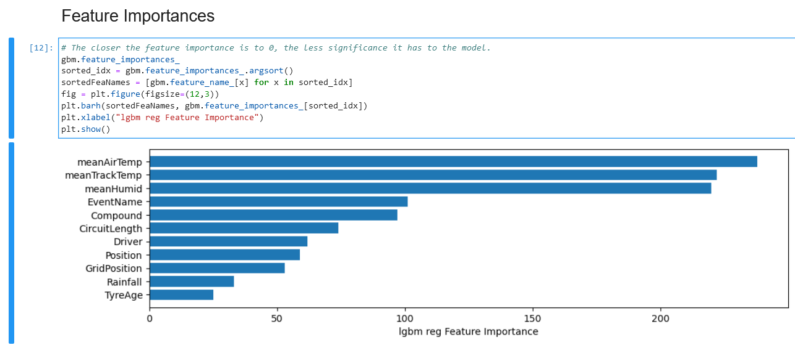
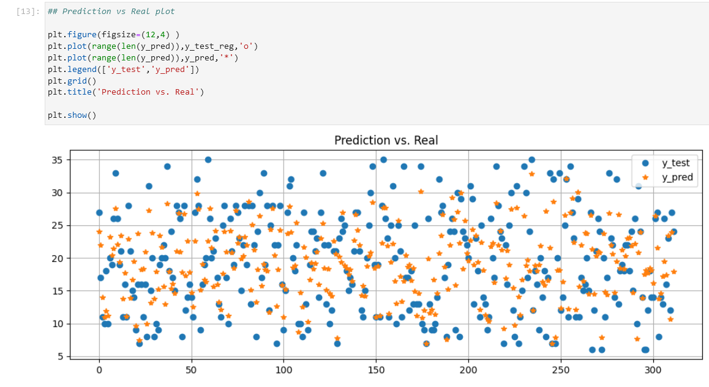
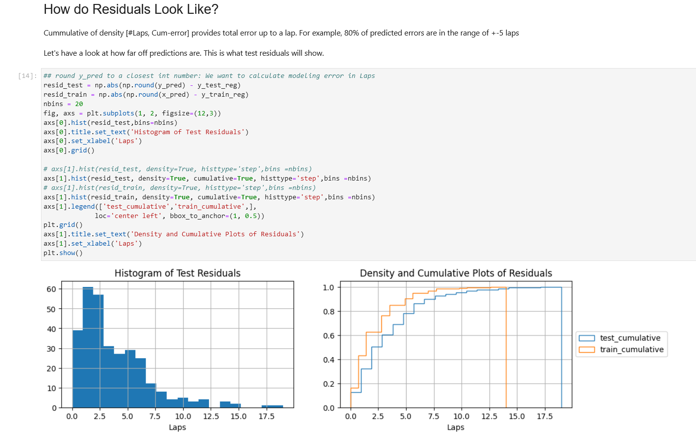
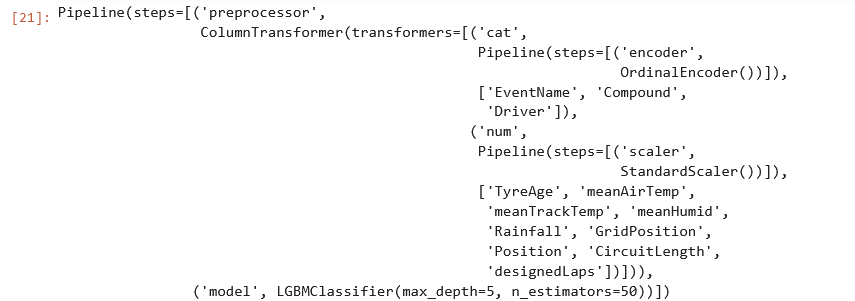

# Model Training

## Introduction

Once we have our dataset ready, this notebook focuses on creating two different ML models: one **classifier** and one **regressor**.

- **Regression** Model: we will predict the optimal stint length for the first stint (stintNum == 1). In other words, we'll predict when it's most optimal for the driver to pit **for the first time** in a race.
- **Classification** Model: we will use **bucketization** as a technique to classify the optimal pit stop window. We will have 5 different buckets; and our model will predict in which of these buckets it's most optimal to pit for the first time in a race.

Estimated Time: 30 minutes

### Objectives

In this lab, you will learn how to train your own Machine Learning models (in an effective way), and what kind of things you need to understand and complete before doing so.

### Prerequisites

- An Oracle Free Tier, Paid or LiveLabs Cloud Account
- Active Oracle Cloud Account with available credits to use for Data Science service.
- Previously created OCI Data Science Environment

## Task 1: Loading Data

The first thing we need to consider is that our final dataset called _`final_data.csv`_ contains data for all stints during races. Since, for both models, we're trying to predict only the optimal first stint length, we'll have to apply _filtering_ to our dataset to remove all data points in our dataset that:

- Have a stint length of less than 5 rounds
- Have a stint length of more than 35 rounds
- Isn't the first stint in the race

> You may ask why is it so important to have stint lengths in between 5 and 35 laps, and the reason is because we've already filtered out these values from previous stages in our workshop / notebooks, we didn't calculate some features (such as slope and bias) for stints with <5 laps, as these values would be unreliable. Also, we're filtering out stints with >35 laps as it's not very common in F1, therefore it would probably add more noise than help our model, if we were to consider them.

Moreover, we apply bucketization to the _`StintLen`_ variable in groups of five rounds. Therefore, if the model were to predict _2_, for example, then the optimal pit window would be in the range of [2\*5=10, 3\*5=15], as each bucket is made of 5 rounds.

> Note that we have about 1250 rows of data for ~4.5 years of data after all this process. If we also remove 'NaN' values (e.g. slope and bias for fuel / tyre degradation are NaN) we get about 200-300 rows of data. Therefore, we _will consider_ NaN values as we otherwise would almost run out of data, and find a way to deal with these indeterminate values in other ways.
 
> **IMPORTANT**: Also note that we'll be using gradient boosted decision trees (XGBM and LGBM models) as our model to solve this, as **they accept NaN values** and this doesn't affect the decision making of these trees.

## Task 2: Variable Correlations and Visualizations

We print variable correlations with _`x[columns].corr()`_ and see the relationship between variables. This is useful to get some initial idea on which variables could be good to select for our ML model.

Looking at tyre compound for the first stint, we have a lot of medium and softs; we don't need to filter C1, C2 tyre compounds (which are different soft compounds, for example) because the dataset we have also makes this distinction with hypersoft, ultrasoft, supersoft and simply soft to distinguish the types of compounds.

We can also notice that, the higher the stint length, the smaller the probability of them being soft tyres.

Finally, we try to observe the track temperature compared to stint length, to see if staying longer on the track without interruption would increase the track temperature over time. However, it's hard to observe any correlation, there are some data points that seem correlated but since track temperature is affected by multiple cars' tyres at different times, the conclusion is that there is no apparent correlation:

## Task 3: Build ML Model

In order to build the model, we do the following things:

- Select the variables that will be considered by our model
- Create a standard scaler to scale numerical values into scaled values, in a way that no variable will be considered as "more important" just for having greater average values than other variable
- Create a label encoder to convert words / categorical variables into numbers that the model will understand
- Apply label encoder to the list of categorical variables in our selected subset of variables

Once we have that, we perform train-test splitting. This means we will divide our dataset's total rows into a testing set (usually around 20%) and a training set (around 80%). The train set will be used to train the model and the test set to validate the accuracy / performance of the model after the model has been trained:

## Task 4: Regression Model

After all our variables are set, standardized, encoded, and our dataset has been split into train/test chunks, we'll create our first model. We'll use a tree-based model, LGBM (Light Gradient Boosted Model).

We can see which variables are considered as _important_ by the model by looking at feature importances. The closer the feature importance is to 1, the better.

We can compare the test values (_`y_pred`_) versus true ones (_`y_test_reg`_) and plot them in a graph, to see how far off each prediction is:

## Task 5: Testing Residuals

Now, we have information about the MAE for our regression model. However, it's also _crucial_ to observe how far each prediction is from reality.

> The above left figure shows the absolute value of residuals. Looking at this, we can observe the amount of errors in each prediction. We see that the figure is very skewed towards the left, which means that most errors are constrained in the range of [0, 5] laps from the true value, and a big part of all these errors in the [0.0, 2.5] range, which means that our model, even though it makes errors, makes relatively "close" errors to reality.
 
> In the above right picture, we have another way to visualize this in percentages: we can see how many % of errors are accumulated in a specific range, e.g. if we look at the '5.0' value in the *x* axis, we see that 80% of **all** errors are within this range ([0, 5]); and 60% of all errors are within the range of (0, 2.5), which means that most errors from the model aren't that far apart from true values. This allows us to conclude that our model is accurate, and this measurement can complement the baseline accuracy of the model (several Data Science problems focus only on baseline model accuracy without looking at residuals).

## Task 6: Modeling with Pipelines

Now that we have a regression model trained, we're going to focus on how to train several models at the same time. This can be achieved with **pipelines**.

We create two different models (LGBM and XGB) with the same initial hyperparameters; and for each model, we will fit our model, calculate accuracy (as this is a classifier), and some additional metrics.

And we can observe the characteristics of our pipeline: the set of encoders, standardizers, variables, and hyperparameters of our model.

> This is especially useful for production environments because it allows for small changes without having to modify big chunks of code.

## Task 7: Testing Model

Using the classifier model (already trained using the pipeline), we can make a test request and see the category that it would land on, and the probability (every class' probability sums to 1 in total) of the prediction:

With the confusion matrix, we can see which values were predicted, and which ones were true. In our case, there's a pronounced diagonal (we can see with the heatmap). This means that the model made relatively good predictions, most of them were what they were supposed to be.

## Task 8: Saving Model

Finally, we save the model in pickle file; and we'll use this pickle file to deploy the model to the Internet in the next and final chapter.

## Conclusions

In this chapter, we have:

- Created two models (one regressor, one classifier)
- Learned how to visualize variable correlations
- Learned how to test residuals - a very underrated and often overlooked technique
- Using _pipelines_ to simplify ML development
- Tested our model
- Saved our model

Let's proceed to the next chapter, where we'll create a Machine Learning model from our dataset, see which variables are indeed useful and which aren't, and get ready to deploy this Machine Learning model to the Internet.

You may now [proceed to the next lab](#next).

## Acknowledgements

- **Author** - Nacho Martinez, Data Science Advocate @ DevRel
- **Contributors** - Victor Martin - Product Strategy Director, Alireza Dibazar - Principal Data Scientist, Vesselin Diev - Senior Director of Data Science, ML Innovation Team
- **Last Updated By/Date** - July 24th, 2023
